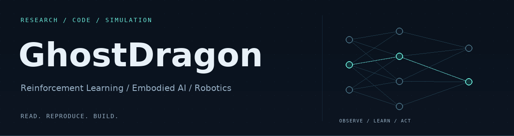

<strong>English</strong> · <a href="https://github.com/GhostDragon9889/GhostDragon9889/blob/main/README.zh-CN.md">简体中文</a>

<picture>
  <source media="(prefers-reduced-motion: reduce) and (max-width: 600px)" srcset="assets/header-mobile.png">
  <source media="(prefers-reduced-motion: reduce)" srcset="assets/header.png">
  <source media="(max-width: 600px)" srcset="assets/header-mobile.gif">
  
</picture>

  <a href="https://ghostdragon9889.github.io/en/">Website</a> ·
  <a href="https://ghostdragon9889.github.io/en/reading/">Paper Notes</a> ·
  <a href="https://ghostdragon9889.github.io/en/knowledge/">Research &amp; Engineering</a> ·
  <a href="https://scholar.google.com/citations?user=-lS94kMAAAAJ">Google Scholar</a>

# Hi, I'm GhostDragon

Exploring **reinforcement learning, embodied AI, and robotics simulation** through papers, reproducible experiments, and code. I use this space to connect research questions with practical implementations.

## GitHub Activity

[Contribution history](https://github.com/GhostDragon9889?tab=overview#js-contribution-activity) · [Profile repository commits](https://github.com/GhostDragon9889/GhostDragon9889/commits/main/) · [Activity updates](https://github.com/GhostDragon9889/GhostDragon9889/actions/workflows/profile-activity.yml)

<!-- ACTIVITY:START -->
Public activity · Updated 2026-10-09 19:13 (UTC+8). Checked every 6 hours; push events may be delayed.

### Recent Commits

- **[aae40ac](https://github.com/GhostDragon9889/GhostDragon9889/commit/aae40ace880e5d2b55fed35a8d5eba2b2539d85e)** · GhostDragon9889/GhostDragon9889
  2026-10-09 19:12 · Add English and Chinese profile navigation with public activity records
- **[3308cfb](https://github.com/GhostDragon9889/GhostDragon9889/commit/3308cfbe06148616e592e7dbc2870bf88cf693a8)** · GhostDragon9889/GhostDragon9889
  2026-10-09 18:58 · Build a dark robotics profile with responsive animated banners
- **[a5fe2e0](https://github.com/GhostDragon9889/GhostDragon9889/commit/a5fe2e044d2e198098810fd08ab76b28cee3e2f0)** · GhostDragon9889/GhostDragon9889
  2026-10-09 18:55 · Initial commit
- **[b82e45e](https://github.com/GhostDragon9889/GhostDragon9889.github.io/commit/b82e45e287af44f85c00708713df3d3aeb4a6f62)** · GhostDragon9889/GhostDragon9889.github.io
  2026-05-29 20:23 · Merge branch &#x27;main&#x27; of github.com:GhostDragon9889/GhostDragon9889.github.io
- **[2128728](https://github.com/GhostDragon9889/GhostDragon9889.github.io/commit/21287285da8cda9a3e2659a2364a15a5abc70740)** · GhostDragon9889/GhostDragon9889.github.io
  2026-05-29 20:21 ·  test

### Recent Pushes

- **[GhostDragon9889/GhostDragon9889.github.io](https://github.com/GhostDragon9889/GhostDragon9889.github.io/compare/35f9486a62e695cf27ac46097786e96aabdd68d1...83b2e01278d73c96f7d81a4b4bc068f5846c8d81)** · main
  2026-10-09 18:31 (UTC+8)
<!-- ACTIVITY:END -->

## Research & Practice

| Area | Focus |
| :--- | :--- |
| **Reinforcement Learning** | Policy learning, training workflows, and experimental reproduction |
| **Embodied AI** | Vision-language-action models, robot manipulation, and navigation |
| **Robotics Simulation** | Isaac Lab / Isaac Sim, MuJoCo, and locomotion control |
| **Research & Engineering** | Paper notes, method comparisons, and reusable engineering records |

## Selected Projects

### [IsaacLab_Walker_S2](https://github.com/GhostDragon9889/IsaacLab_Walker_S2)

Walker S2 simulation experiments built on Isaac Lab, with robot assets, environment configurations, and reinforcement learning training configurations.

`Isaac Lab` `Python` `Locomotion`

### [Simulation](https://github.com/GhostDragon9889/Simulation)

Simulation practice based on the Isaac Lab extension template, covering scene creation, robot configurations, and training scripts.

`Isaac Sim` `Simulation` `Python`

### [Research & Engineering Website](https://ghostdragon9889.github.io/en/)

Paper notes on embodied AI, comparisons across methods, and engineering practice collected in one place.

[Paper notes →](https://ghostdragon9889.github.io/en/reading/) · [Research & engineering →](https://ghostdragon9889.github.io/en/knowledge/) · [Website source →](https://github.com/GhostDragon9889/GhostDragon9889.github.io)

## Learning & Reproduction

Public forks I explore for learning and reproduction. Original work belongs to the respective upstream authors.

Explore navigation, simulation, and paper-reading resources

- [NavIsaaclab2.0](https://github.com/GhostDragon9889/NavIsaaclab2.0): robot navigation in shared human-robot environments. Upstream: [yh83305/NavIsaaclab2.0](https://github.com/yh83305/NavIsaaclab2.0).
- [mujoco_learning](https://github.com/GhostDragon9889/mujoco_learning): MuJoCo modeling and Python / C++ interfaces. Upstream: [Albusgive/mujoco_learning](https://github.com/Albusgive/mujoco_learning).
- [daily-paper-reader](https://github.com/GhostDragon9889/daily-paper-reader): paper recommendations and AI-assisted reading. Upstream: [ziwenhahaha/daily-paper-reader](https://github.com/ziwenhahaha/daily-paper-reader).

---

Read thoughtfully. Reproduce carefully. Build steadily.

